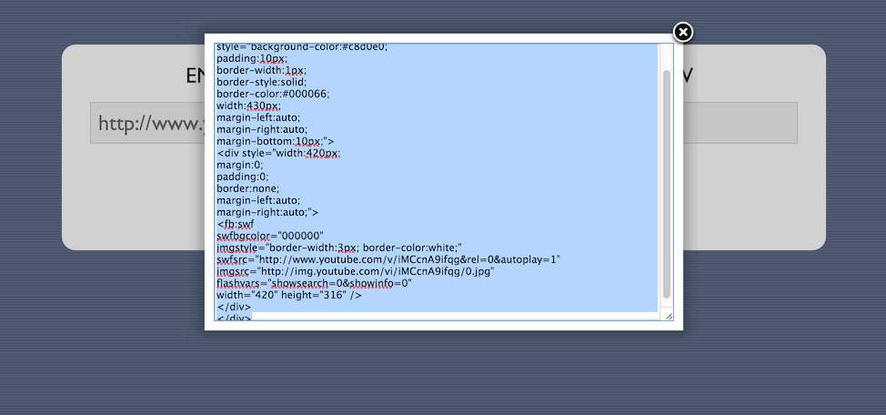

Facebook Page YouTube SWF Generator
===================================

This is a mini utility that I made for Theresa to make it easier for her to embed
YouTube videos on the university's facebook page. It basically just takes a link
to a YouTube video and generates the fbswf code with some inline formatting to 
make everything look pretty

## Notes / Terms

I **do not own fancybox**. It's heavily used in this project and I'm very
grateful for it; however, all rights / credits / everything goes to
<http://fancybox.net/>.
